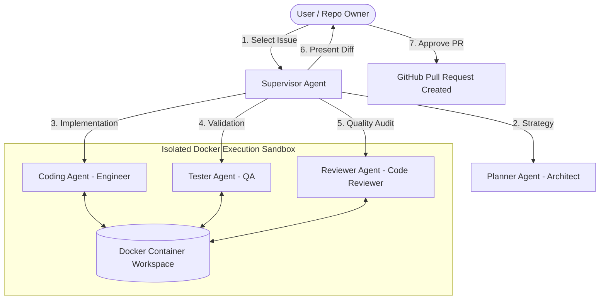

<div align="center">

# ⚡ ResolvAI

### Autonomous Multi-Agent Software Engineering Platform

ResolvAI is an enterprise-grade, autonomous software engineering platform powered by **LangGraph multi-agent orchestration**, **isolated Docker execution containers**, and **embedded Monaco code editing**.

An intelligent **Supervisor Agent** coordinates specialized AI agents (**Planner Architect**, **Coding Engineer**, **Tester QA**, and **Code Reviewer**) to autonomously clone repositories, diagnose GitHub issues, write code patches, execute test suites inside Docker containers, evaluate code quality, and open Pull Requests.

</div>

---

## Key Features

- **LangGraph Multi-Agent Orchestration**
  - **Supervisor Agent**: Central intelligence making dynamic routing decisions based on real-time team reports and user instructions.
  - **Planner Agent (Architect)**: Performs read-only repository analysis, dependency inspection, and strategy planning.
  - **Coding Agent (Engineer)**: Implements precise code modifications, updates tests, and builds features.
  - **Tester Agent (QA Engineer)**: Executes builds, test suites, and linters inside isolated Docker containers.
  - **Reviewer Agent (Code Reviewer)**: Audits code quality, maintainability, architectural compliance, and edge cases.

- **Per-Agent Model Configuration & Fallbacks**
  - We currently support **Anthropic**, **OpenAI**, **Groq**, and **Google AI Studio**.
  - Independently configure distinct LLM models and providers for each agent (e.g., GPT-4o for Supervisor, Claude 3.5 Sonnet for Coding Agent, Llama-3 for Tester).
  - Configurable primary and fallback models per agent to guarantee maximum reliability and cost optimization.
  - Save and autofill per-model presets with single-click `Autofill` and `View Models` modal breakdowns.

- **Custom Agent Skills & Special Instructions**
  - **Custom Agent Skills**: Inject specialized skill guidelines and domain rules on a per-agent basis.
  - **Special Instructions**: Define global session instructions for all agents to enforce specific project conventions.
  - **Custom Environment Variables**: Pass custom build, database, and API environment variables directly into the Docker sandbox via the UI.

- **Isolated Docker Execution Containers**
  - Deterministic container creation with auto-detected Docker/Podman sockets (`/var/run/docker.sock`, `/run/user/1000/docker.sock`).
  - Isolated dependency installation, command verification, and Git author identity configuration (`GIT_AUTHOR_NAME`, `GIT_AUTHOR_EMAIL`).
  - Active container state liveness preservation across revision cycles and automatic self-healing container cleanup.

- **Interactive Live Workflow Diagram**
  - Visual DAG powered by `@xyflow/react` with smooth-step edge curves, animated state feedback, and status checkmarks.
  - Responsive auto-scaling via `ResizeObserver` so workflow nodes are never cut off during side panel toggles.

- **Monaco Code Sandbox & Diff Viewer**
  - VS Code-style side panel with collapsible recursive folder tree, file search, line counters, and Monaco editor.
  - Side-by-side Monaco `DiffEditor` for reviewing before/after git patches prior to PR creation.
  - Robust unified git diff parser handling additions, deletions, renames, and dev/null paths.

- **Persistent Debug Logs & Session History**
  - Real-time Socket.IO execution feed paired with SQLite persistence (`better-sqlite3`).
  - Persistent activity feed tracking tool invocations, terminal outputs, build failures, and error stack traces.
  - Session history dashboard with individual session deletion and one-click clear history confirmation.

---

## Architecture Overview



---

## Agent Specifications & Tool Scoping

Every agent in ResolvAI operates under strict role constraints and tool permissions to ensure maximum security, modularity, and deterministic execution:

| Agent | Role & Scope | Allowed Tools & Capabilities |
| :--- | :--- | :--- |
| **Supervisor** | Workflow orchestration, routing decisions, human feedback evaluation, PR creation. | LangGraph state management, LLM Decision Dispatch, GitHub PR creation.|
| **Planner** *(Architect)* | Read-only codebase exploration, dependency analysis, strategy planning. | `get_repository_profile`, `get_repository_context`, `list_directory`, `tree`, `stat`, `read_file`, `write_file` *(report only)*, `create_file` *(report only)*, `replace_file_content` *(report only)*, `search_text`, `find_files`, `git_log`, `web_search`. |
| **Coding Agent** *(Engineer)* | Implements code changes, updates tests, creates/deletes files inside container. | `get_repository_profile`, `get_repository_context`, `list_directory`, `tree`, `stat`, `read_file`, `write_file`, `create_file`, `replace_file_content`, `delete_file`, `search_text`, `find_files`, `terminal`, `build`, `linter`, `git_diff`, `git_status`. |
| **Tester** *(QA Engineer)* | Runs builds, test suites, and linters inside isolated Docker container. | `get_repository_profile`, `list_directory`, `tree`, `stat`, `read_file`, `write_file`, `create_file`, `replace_file_content`, `delete_file`, `build`, `test`, `linter`, `terminal`, `git_diff`, `git_status`, `web_search`. |
| **Reviewer** *(Code Reviewer)* | Evaluates engineering quality, maintainability, architectural compliance, and edge cases. | `get_repository_profile`, `get_repository_context`, `list_directory`, `tree`, `stat`, `read_file`, `write_file` *(report only)*, `create_file` *(report only)*, `replace_file_content` *(report only)*, `search_text`, `find_files`, `git_diff`, `git_status`, `git_log`. |

---

## Tech Stack

### Frontend
- **Framework**: [Next.js 14](https://nextjs.org/) (App Router, React 18, TypeScript)
- **Styling**: Vanilla CSS Design Tokens, TailwindCSS
- **Diagrams**: `@xyflow/react` (ReactFlow)
- **Editor**: `@monaco-editor/react` (Monaco Editor & DiffEditor)
- **State Management**: Zustand & React Hooks
- **Icons**: Lucide React

### Backend
- **Runtime**: Node.js & Express (TypeScript)
- **Orchestration**: `@langchain/langgraph`, `@langchain/core`
- **Containerization**: `dockerode` (Docker & Podman support)
- **Database**: `better-sqlite3` (WAL mode SQLite)
- **LLM Proxy**: LiteLLM Proxy Server
- **WebSockets**: Socket.IO for real-time live event streaming
- **Web Search**: `@tavily/core`

---

## Prerequisites

Before running ResolvAI, ensure you have installed:

- **Node.js**: v18.0.0 or higher
- **npm**: v9.0.0 or higher
- **Python**: v3.10+ (for LiteLLM proxy)
- **Docker Engine** or **Podman**: Running with socket access (`/var/run/docker.sock` or `/run/user/1000/docker.sock`)
- **GitHub Personal Access Token (PAT)**: With `repo` and `workflow` scopes

---

## Installation & Setup

### 1. Clone the Repository

```bash
git clone https://github.com/Lakshya-23/ResolveAi.git
cd ResolveAi
```

### 2. Install Python & Node Dependencies

Install Python dependencies for LiteLLM:

```bash
pip install -r requirements.txt
```

Install Backend dependencies:

```bash
cd backend
npm install
```

Install Frontend dependencies:

```bash
cd ../frontend
npm install
```

### 3. Environment Configuration

Create backend `.env` file inside `backend/.env`:

```env
# Server Configuration
PORT=5000
NODE_ENV=development
CORS_ORIGIN=http://localhost:3000

# LiteLLM Proxy URL
LITELLM_BASE_URL=http://localhost:4000

# SQLite Database Location
DB_PATH=./data/resolveai.db

# Docker Workspace Base
DOCKER_WORKSPACE_BASE=/tmp/resolveai-workspaces

# Git Author Identity
GIT_AUTHOR_NAME=ResolvAI
GIT_AUTHOR_EMAIL=bot@resolvai.dev

# LLM API Keys
OPENAI_API_KEY=sk-proj-...
GEMINI_API_KEY=AIzaSy...
GROQ_API_KEY=gsk_...
ANTHROPIC_API_KEY=sk-ant-...

# Optional Web Search Key
TAVILY_API_KEY=tvly-...

# Supervisor Settings
SUPERVISOR_MAX_ITERATIONS=50
```

Create frontend `.env` file inside `frontend/.env`:

```env
NEXT_PUBLIC_API_URL=http://localhost:5000/api
```

---

## Running the Application

### Step 1: Start LiteLLM Proxy

In the project root directory, run:

```bash
litellm --config backend/litellm_config.yaml --port 4000
```

### Step 2: Start Backend Server

In the `backend` directory, run:

```bash
cd backend
npm run dev
```

### Step 3: Start Frontend Web App

In the `frontend` directory, run:

```bash
cd frontend
npm run dev
```

Open [http://localhost:3000](http://localhost:3000) in your browser to launch ResolvAI.

---

## Usage Guide

1. **Authentication**: Enter your GitHub Personal Access Token (PAT) to authenticate.
2. **Session Configuration**: Select target GitHub repository and issue. Customize per-agent model configurations, inject agent skills/instructions, and set build environment variables.
3. **Autonomous Execution**: ResolvAI automatically boots the Docker container, clones the repo, analyzes architecture, creates a plan, implements code changes, runs unit tests, and conducts code review.
4. **Workspace & Diff Inspection**: Toggle **Code Panel** to explore the container workspace in Monaco Editor or view side-by-side diff patches in Diff Viewer.
5. **Approval & PR Creation**: Inspect report summaries and click **Approve PR** to automatically push the branch and open a GitHub Pull Request.
